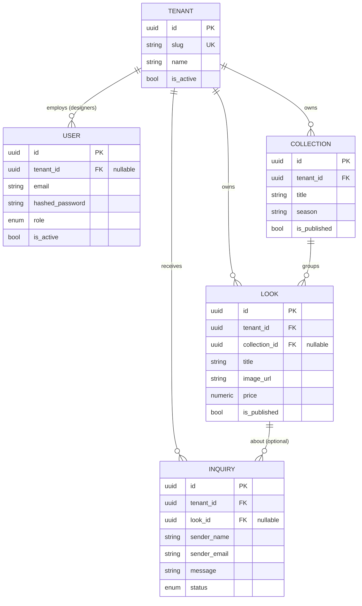

# Fashion Hub — Architecture

> **Status:** Phase 1 (skeleton). The database schema below is the *target* logical model. Actual
> SQLModel models and Alembic migrations are implemented in **Phase 2** — this document is the
> contract they must satisfy.

## 1. Overview

Fashion Hub is a **multi-tenant SaaS platform** for fashion designers. Each designer ("tenant")
gets an isolated storefront reachable at their own subdomain (`designer1.localhost` in dev,
`designer1.fashionhub.app` in prod). A separate global marketplace aggregates published looks
across all tenants for consumer ("normal user") browsing.

### Component map

```
                            ┌────────────────────────────┐
   *.localhost  ──────────▶ │           Traefik          │  (reverse proxy, subdomain routing, TLS)
                            └──────────────┬─────────────┘
                       PathPrefix(/api)    │    everything else
                            ┌──────────────┴──────────────┐
                            ▼                              ▼
                  ┌──────────────────┐          ┌────────────────────┐
                  │   FastAPI (API)  │          │  React SPA (Vite)  │
                  │  SQLModel/Pydantic│         │  Tailwind + shadcn │
                  └────────┬─────────┘          └────────────────────┘
                           │
                           ▼
                  ┌──────────────────┐
                  │   PostgreSQL     │  (shared DB, logical tenant isolation via tenant_id)
                  └──────────────────┘
```

## 2. Multi-Tenancy Strategy

**Model: logical (shared-database, shared-schema) isolation.** One PostgreSQL database; every
tenant-scoped table carries a non-null `tenant_id` foreign key to `tenant.id`. This is the simplest
model to operate at early scale and lets the global marketplace query across tenants trivially. We
can migrate hot tenants to schema- or database-per-tenant later without changing the API contract.

### 2.1 Tenant resolution (`get_current_tenant` dependency — Phase 2)

Every tenant-scoped request must resolve a tenant. Resolution order:

1. **Subdomain (primary).** Parse the request `Host`. The left-most label is the tenant `slug`
   (e.g. `designer1.localhost` → slug `designer1`). Reserved labels (`api`, `www`, `traefik`,
   `app`, the bare apex) are **not** tenants.
2. **`X-Tenant-ID` header (fallback).** For local dev, direct API calls, and Playwright E2E where
   driving real subdomains is awkward, an explicit `X-Tenant-ID: <uuid-or-slug>` header selects the
   tenant.
3. If neither yields an **active** tenant, the dependency raises **HTTP 400** (`tenant_required`)
   for tenant-scoped routes. Global/marketplace and auth routes do not use this dependency.

```python
# Contract (implemented in Phase 2, app/api/deps.py)
def get_current_tenant(
    request: Request,
    x_tenant_id: str | None = Header(default=None),
    session: Session = Depends(get_db),
) -> Tenant:
    slug = extract_subdomain(request.headers["host"])      # None for reserved/apex hosts
    tenant = resolve_tenant(session, slug=slug, header=x_tenant_id)
    if tenant is None or not tenant.is_active:
        raise HTTPException(400, "tenant_required")
    return tenant
```

### 2.2 Isolation enforcement

Resolving the tenant is not enough — **every query against a tenant-scoped table must filter by
`tenant_id`**. To prevent a forgotten filter (the classic cross-tenant leak), Phase 2 introduces a
mandatory helper that all CRUD goes through:

```python
# app/crud/base.py (Phase 2)
def tenant_query(model, tenant: Tenant):
    """Return a select() already scoped to the tenant. Routes MUST start here."""
    return select(model).where(model.tenant_id == tenant.id)
```

Writes set `tenant_id = tenant.id` server-side from the resolved tenant — never from client input.
Phase 6 adds Pytest cases that assert tenant A can never read/write tenant B's rows.

## 3. Data Model

### 3.1 Entities

| Entity        | Purpose                                              | Tenant-scoped? |
|---------------|------------------------------------------------------|----------------|
| **Tenant**    | A designer's account/storefront. The isolation key.  | — (is the key) |
| **User**      | Auth principal: designer, consumer, or admin.        | designers: yes; consumers/admins: no (`tenant_id` null) |
| **Collection**| A themed grouping of looks (e.g. "SS26").             | yes            |
| **Look**      | A single catalog item (garment/outfit) with imagery. | yes            |
| **Inquiry**   | A message from a visitor about a look/designer.       | yes            |

### 3.2 Fields

**Tenant**
- `id: UUID` (pk)
- `slug: str` (unique, indexed — the subdomain label)
- `name: str`
- `is_active: bool` (default `true`)
- `created_at, updated_at: datetime`

**User**
- `id: UUID` (pk)
- `tenant_id: UUID | null` (fk → tenant.id; null for consumers/admins)
- `email: str` (unique **within tenant**; global-unique for null-tenant accounts)
- `hashed_password: str`
- `role: enum{designer, consumer, admin}`
- `full_name: str | null`
- `is_active: bool` (default `true`)
- `created_at, updated_at: datetime`

**Collection**
- `id: UUID` (pk)
- `tenant_id: UUID` (fk → tenant.id, indexed)
- `title: str`
- `description: str | null`
- `season: str | null`
- `is_published: bool` (default `false`)
- `created_at, updated_at: datetime`

**Look**
- `id: UUID` (pk)
- `tenant_id: UUID` (fk → tenant.id, indexed)
- `collection_id: UUID | null` (fk → collection.id)
- `title: str`
- `description: str | null`
- `image_url: str`
- `price: numeric(10,2) | null`
- `is_published: bool` (default `false`)
- `created_at, updated_at: datetime`

**Inquiry**
- `id: UUID` (pk)
- `tenant_id: UUID` (fk → tenant.id, indexed)
- `look_id: UUID | null` (fk → look.id)
- `sender_name: str`
- `sender_email: str`
- `message: str`
- `status: enum{new, read, archived}` (default `new`)
- `created_at: datetime`

### 3.3 ER diagram



### 3.4 Index recommendations

- `tenant.slug` — unique, used on every subdomain request.
- Composite `(tenant_id, is_published)` on `collection` and `look` — the storefront and marketplace
  filter published rows per tenant.
- `(tenant_id, status)` on `inquiry` — the dashboard lists a tenant's inbox by status.
- `look.collection_id` — grouping lookups.
- Partial index on `look (is_published) WHERE is_published` — the global feed reads only published.

## 4. Backend layout (target, filled in across phases)

```
backend/app/
├── main.py            # app factory + middleware + router mount
├── core/
│   ├── config.py      # Settings (env)            [Phase 1]
│   ├── db.py          # engine + get_db session   [Phase 2]
│   └── security.py    # password hashing + JWT     [Phase 2]
├── models/            # SQLModel table models       [Phase 2]
├── schemas/           # Pydantic request/response   [Phase 2]
├── crud/              # tenant_query + per-entity   [Phase 2/3]
├── api/
│   ├── main.py        # api_router aggregator
│   ├── deps.py        # get_db, get_current_tenant, get_current_user  [Phase 2]
│   └── routes/        # utils(P1), auth(P2), collections/looks(P3), ...
└── alembic/           # migrations                  [Phase 2]
```

## 5. Roadmap & phase boundaries

| Phase | Delivers |
|-------|----------|
| **1** | Skeleton, docs, Docker Compose (Postgres + placeholder backend/frontend + Traefik subdomain routing). |
| **2** | SQLModel models + Alembic migrations, `get_current_tenant`/`get_current_user`, JWT auth & registration. |
| **3** | Collections/Looks CRUD (tenant-isolated) + Designer Dashboard UI. |
| **4** | Public per-subdomain storefronts + public inquiry forms. |
| **5** | Global marketplace feed + consumer moodboards/profile. |
| **6** | Pytest tenant-leak tests + Playwright E2E inquiry flow. |
